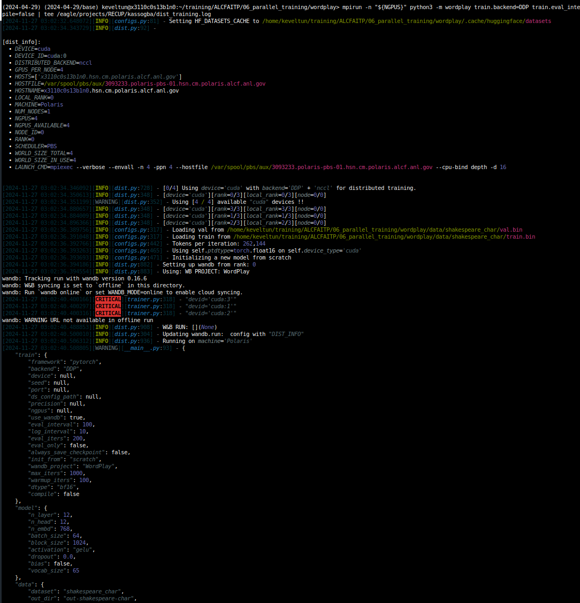

# Homework Submission

To verify the successful execution of the distributed data parallel training run, please refer to the following screenshots captured at the beginning, during and at the end of the training, or refer to the log available at `/eagle/projects/RECUP/kassogba/dist_training.log`

